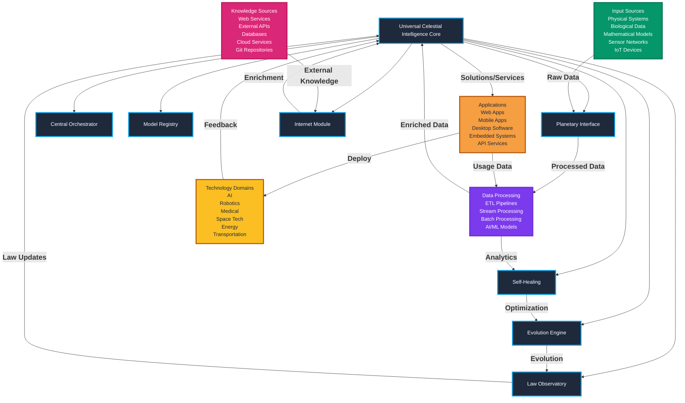

# Universal Celestial Intelligence Architecture & Workflow

## System Architecture Overview



## Notes

1. **Universal Data Ingestion**
   - Supports any data format through Planetary Interface
   - Protocol-agnostic adapters
   - Automatic schema detection and mapping

2. **Processing Pipeline**
   - Pattern recognition across domains
   - Cross-domain knowledge synthesis
   - Continuous evolution and optimization

3. **Solution Generation**
   - Context-aware pattern matching
   - Automated solution composition
   - Validation and deployment automation

4. **Integration Points**
   - REST/GraphQL APIs
   - Event streams
   - Message queues
   - File systems
   - Database systems
   - IoT protocols

5. **Extension Mechanisms**
   - Plugin architecture
   - Custom protocol adapters
   - Domain-specific processors
   - Solution templates

## Key Benefits

1. **Universal Compatibility**
   - Works with any data source
   - Supports all major protocols
   - Domain-agnostic processing

2. **Intelligent Evolution**
   - Self-learning patterns
   - Cross-domain optimization
   - Automated improvement

3. **Resilience**
   - Self-healing capabilities
   - Fault tolerance
   - Automatic recovery

4. **Scalability**
   - Horizontal scaling
   - Distributed processing
   - Load balancing

## Exporting Diagrams

To export the architecture diagrams as image files:

1. Install Julia dependencies:
```julia
using Pkg
Pkg.add(["HTTP", "JSON3", "Base64"])
```

2. Run the export script:
```bash
julia tools/export_diagrams.jl
```

This will create both PNG and SVG versions of all diagrams in `docs/diagrams/`:
- `system_flow.png` / `system_flow.svg`
- `component_interactions.png` / `component_interactions.svg`
- `universal_integration.png` / `universal_integration.svg`

You can then use these image files for presentations, documentation, or sharing on platforms that don't support Mermaid rendering.

This architecture enables UCI to serve as a universal brain that can:
- Ingest any type of data
- Learn patterns across domains
- Generate optimized solutions
- Deploy to any technology stack
- Continuously evolve and improve
